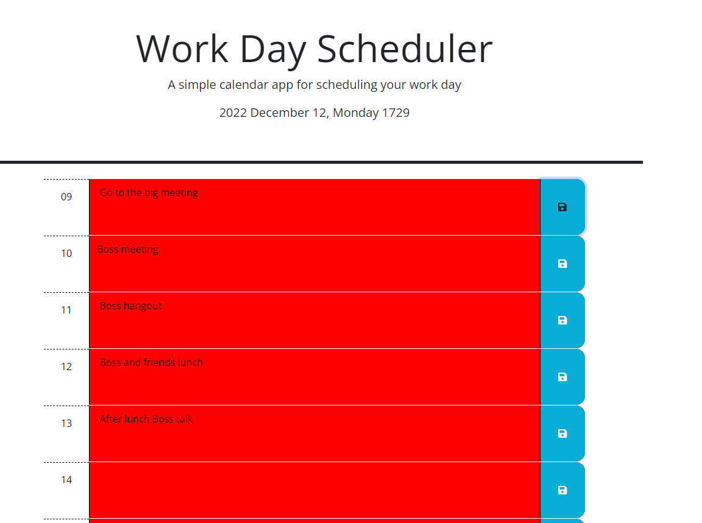

# daily-appointments
Day tracker for appointments for a day.

# Description

This is a simple hour by hour tracker for dailiy appointmes. The user is able to
enter events for that day for reference later. If the page is closed and 
reopened the values entered in for each hour will remain thanks to localStorage.

They are olor coded too so time blocks that are in the past are red, the current
hour is grey, and the future is green.

# Usage

This can be used by opening up the page and entering the day's appointments into
he text areas. Then click the floppy disk to save that data for when you come
back to the page the information remains.

Information must be _mannually_ remove from each textarea.

# Credit

Creidt for

# License

MIT open

# Screen shots

